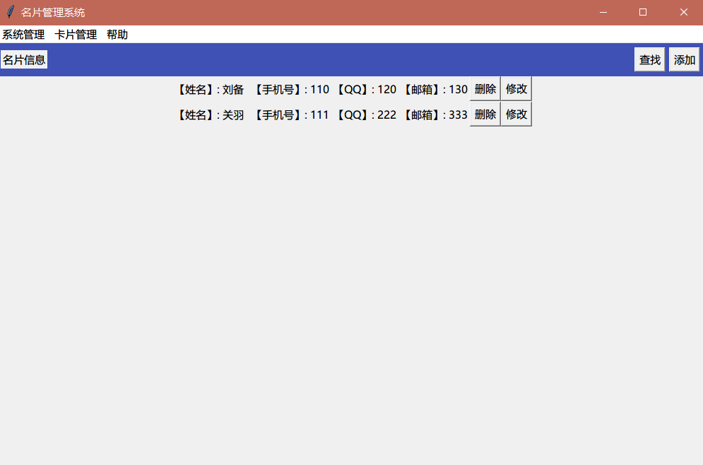
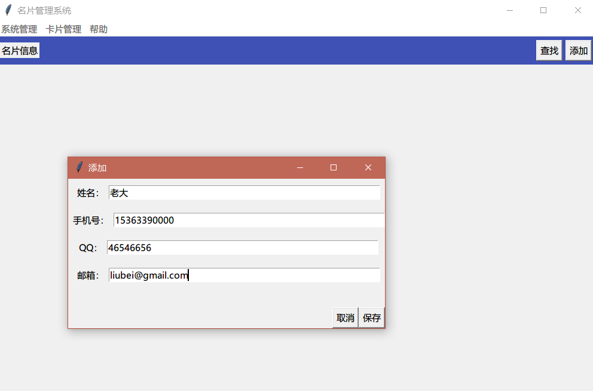
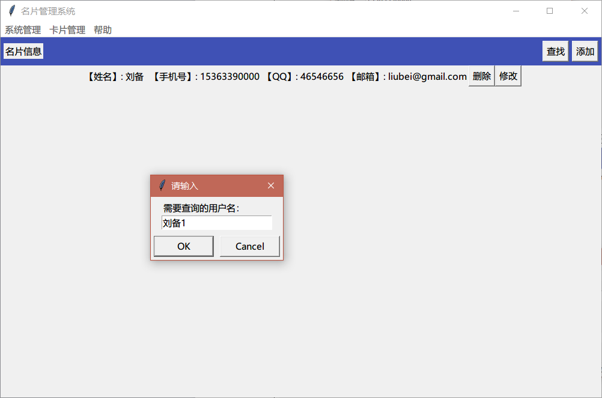
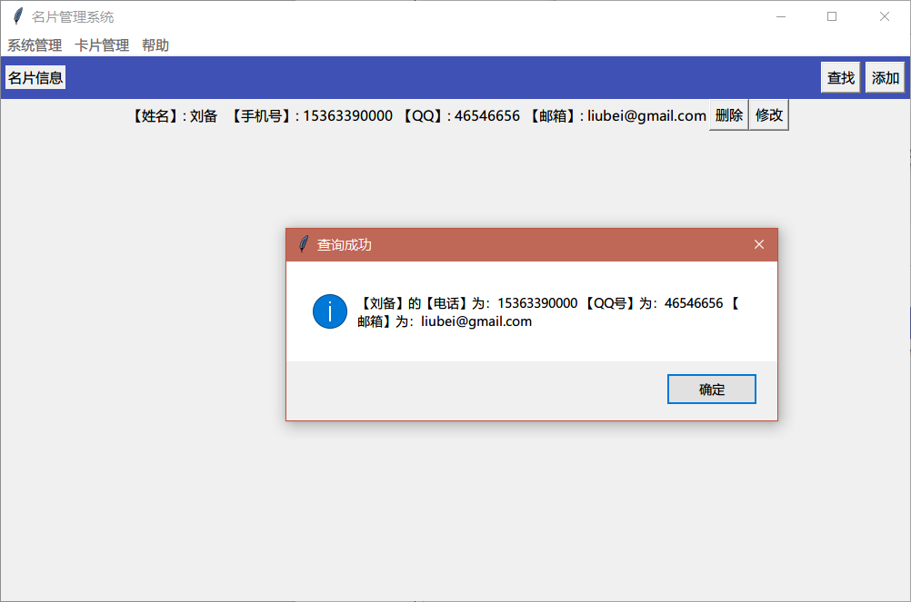

# 一、系统分析

  系统应该设计两个类，即卡片（Card）类和卡片管理系统（Card_mannager）类；

# 二、系统设计

两个类中定义的属性和方法为：

###   1.卡片类__init__()方法：

初始化实例属性：姓名、电话、QQ、Email；

###   2.卡片类__str__()方法：

   return f"{self.name},{self.phone}……" 

   输出对象的属性值（以 f 或 F 开头的字符串，其中以 {} 包含的表达式会进行值替换）

#### 1）系统类__init__（）方法：

 定义实例属性card_list卡片列表

#### 2）系统类 new_card(self)方法：

 输入信息，创建卡片对象，添加到卡片列表

#### 3）系统类show_all(self)方法：

  显示所有卡片

#### 4) 系统类search_card(self)方法：

  请输入要查找的姓名, 遍历card_list,找到就打印终止遍历，否则提示没找到。

#### 5）系统类save_card(self)方法：

  打开数据文件，利用data=[i.__dict__ for i in self.card_list]将对象类型转化为字典类型；再写入数据文件；最后关闭文件。

#### 6）系统类load_card(self)方法:

打开文件，读取文件数据data=f.read()，转换数据类型cardlist=eval(data)，创建对象加载到cardlist中去： self.card_list=[Card(i["name"],i["phone"]，……) for i in cardlist]；最后关闭文件。    

#### 7）系统类show_menu()静态方法：

 定义@staticmethod显示菜单

#### 8）系统类run(self)方法：

编写入口函数：加载数据；while True:显示菜单，提示选择功能，根据选项调用执行系统类相应方法或者结束循环退出系统。

### 3.测试代码：

if __name__=="__main__":

  system=Card_manager()

  system.run()